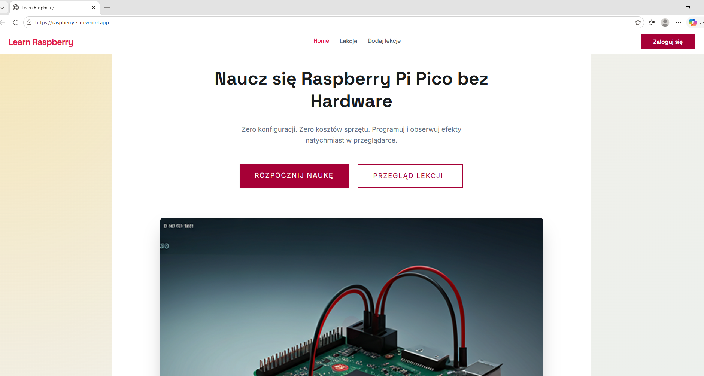
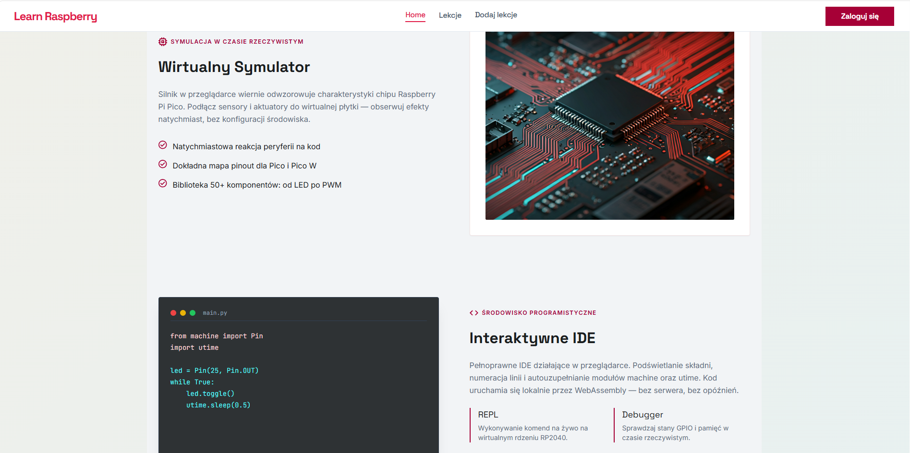
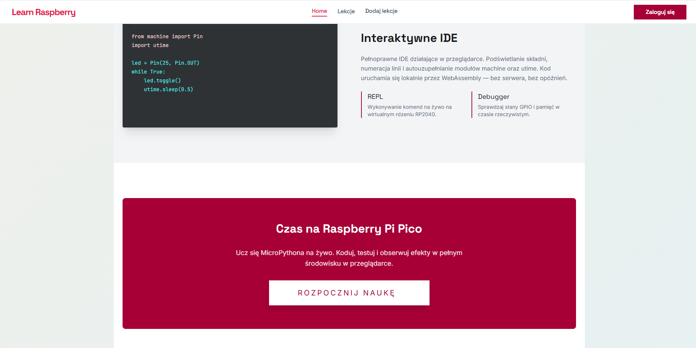
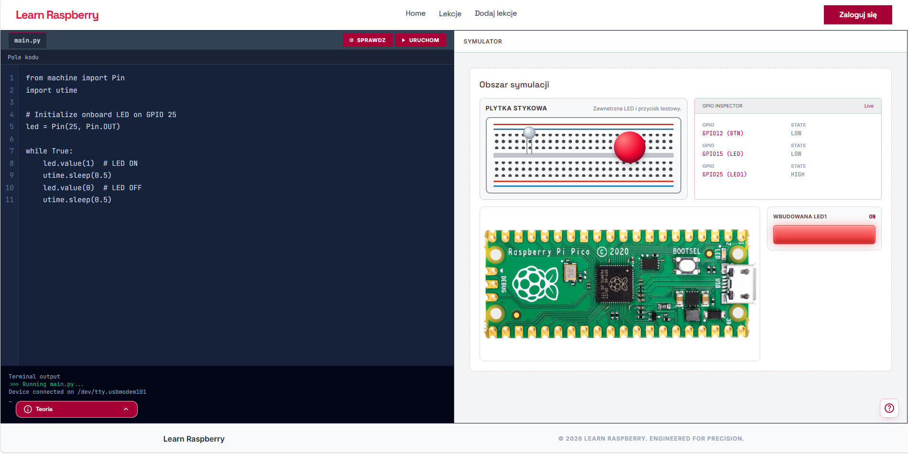
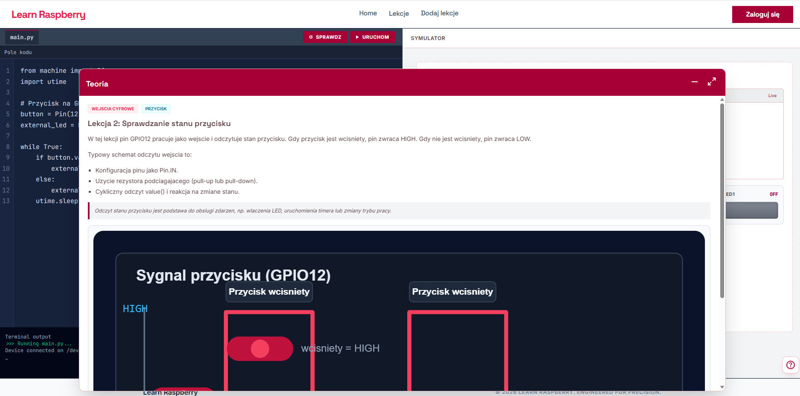
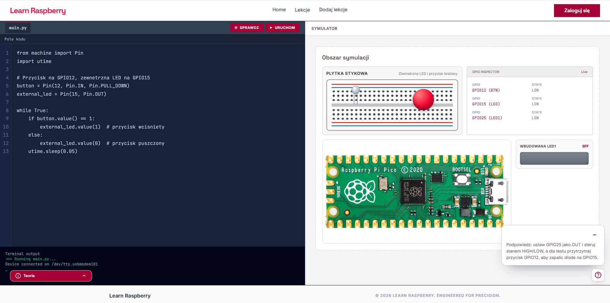
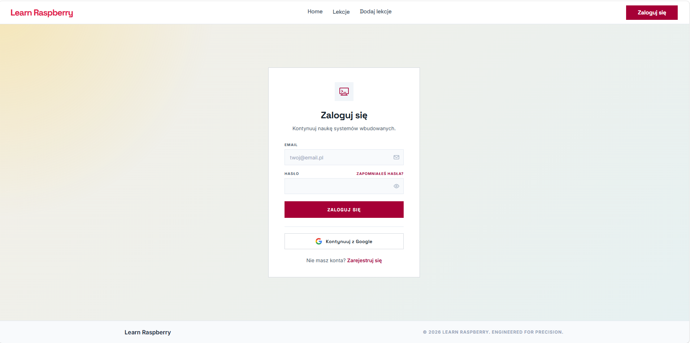
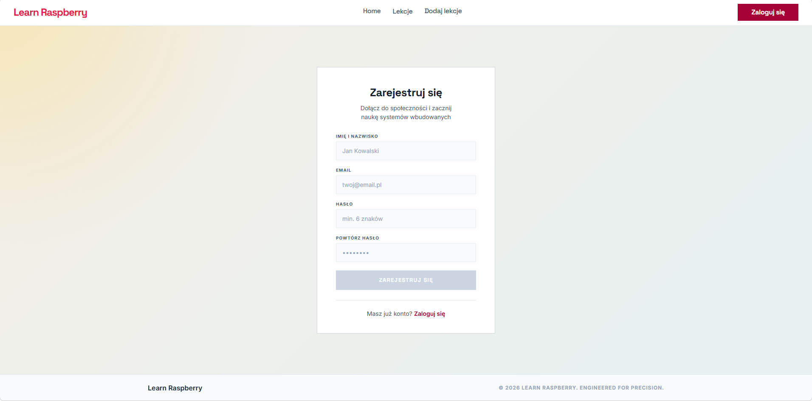
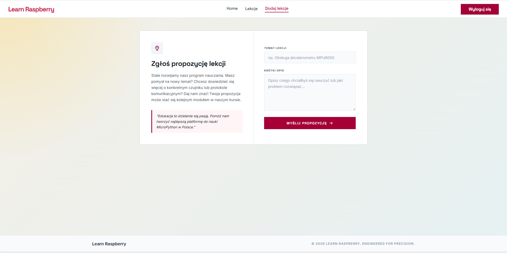

# Raspberry_Sim

Ogólny szkielet projektu pod aplikację REST z trzema głównymi ekranami:
- strona powitalna,
- główna strona edukacyjna,
- strona "o stronie".

## Struktura

### Frontend
- `src/layouts` - layout z miejscem na menu, content i footer.
- `src/pages` - ekrany aplikacji dostępne przez router.
- `src/components` - współdzielone elementy UI.
- `src/features/users` - wydzielony moduł pod funkcje użytkowników.
- `src/services/api` - klient REST i endpointy.

### Backend
- `backend/app/api/routes` - trasy REST.
- `backend/app/services` - logika biznesowa.
- `backend/app/repositories` - dostęp do danych.
- `backend/app/models` - modele ORM.
- `backend/app/schemas` - schematy wejścia/wyjścia.
- `backend/database/users` - migracje, seed i zapytania pod bazę użytkowników.

## Sposob uruchomienia

1. Przejdz do katalogu projektu:

```bash
cd /home/user/Projects/Raspberry_Sim
```

2. Uruchom caly stack (frontend + backend + baza danych):

```bash
docker compose up --build
```

3. Adresy aplikacji po uruchomieniu:
- frontend: http://localhost:5173
- strona lekcji: http://localhost:5173/lesson
- backend API: http://localhost:8000
- endpoint zdrowia: http://localhost:8000/health
- baza PostgreSQL: localhost:5432

4. Zatrzymanie uslug:

```bash
docker compose down
```

Uwaga:
- Domyslnie frontend korzysta z API pod adresem http://localhost:8000/api

## Deploy

https://raspberry-sim.vercel.app/

## Zrzuty ekranu
### Strona główna



### Strona zajęć



### Logowanie


### Dodanie lekcji

## Hotjar


## Google analyst

